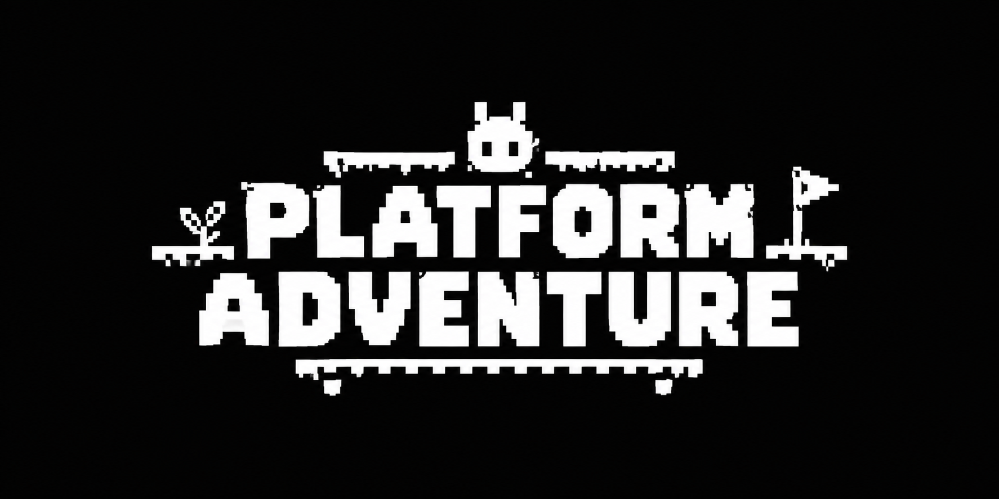

<div align="center">
  
  
  # 🐰 Platform Adventure
  
 | Unity 6**
  **Proyecto Final de Desarrollo de Videojuegos | Unity 6**
  
  *Un plataformas 2D construido sobre arquitectura escalable, principios SOLID y optimización física.*
</div>

---

## 🎯 Visión del Proyecto

**Platform Adventure** es un título de plataformas 2D diseñado no solo como un nivel jugable, sino como un **framework base escalable**. El enfoque principal del desarrollo ha sido evitar el "código espagueti" mediante la separación de responsabilidades, preparando el terreno para una fácil integración de futuros niveles, enemigos y mecánicas sin alterar el núcleo del juego.

---

## 🛠️ Arquitectura y Patrones de Diseño

El sistema fue desarrollado bajo el principio de **Responsabilidad Única (SRP)**, dividiendo la lógica de juego de la presentación visual y auditiva:

* **Patrón Singleton:** Implementado en `GameManager` y `UIManager` para proveer acceso global controlado a estados persistentes de sesión, previniendo duplicados entre escenas.
* **Patrón Observer (Event-Driven Architecture):** 
  * Desacoplamiento total entre lógica de datos (`GameManager`, `PlayerHealth`) y renderizado de interfaz (`UIManager`).
  * Emisión de eventos fuertemente tipados (`event Action<int>`) al cambiar puntos o vidas.
  * La UI actúa como un **Receptor Pasivo**, suscribiéndose en `OnEnable()` y cancelando en `OnDisable()`, eliminando fugas de memoria y prescindiendo de lecturas costosas en `Update()`.

---

## ⚙️ Físicas 2D, Cámara y Rendimiento

* **Composite Collider 2D:** Implementado en el `Ground_Tilemap` (Static + Polygons). Fusiona los colliders de cada tile en una malla única y continua, erradicando microbloqueos de desplazamiento horizontal y reduciendo el overhead del motor de físicas.
* **Cinemachine Virtual Camera:**
  * **Dead Zones:** Zona muerta calibrada en `Y` para estabilizar el encuadre durante saltos cortos.
  * **Damping & Lookahead:** Suavizado de seguimiento y anticipación de avance horizontal con bloqueo vertical (*Ignore Y*) para transiciones direccionales limpias.
  * **Cinemachine Impulse:** Respuesta háptica visual (*screen shake*) modulada ante eventos de impacto.

---

## 🎮 UI / UX e Inmersión Sensorial ("Juice")

* **Diseño Responsivo:** `Canvas Scaler` configurado en `Scale With Screen Size` (1920x1080) garantizando consistencia en cualquier resolución.
* **HUD Reactivo:** Actualización instantánea de variables y efecto procedural de temblor (*heart shake*) en estado crítico de vida.
* **Arquitectura de Audio (AudioMixer):** Mezcla profesional jerárquica con buses separados (`Master`, `Music`, `SFX`) y enrutamiento dinámico desde fuentes como `PlayerAudio`.
* **Feedback Visual:** Sistemas de partículas (VFX) al interactuar con el entorno y parpadeo cromático (`PlayerFlash`) ante estados de daño.

---

## 📂 Estructura Modular de Scripts (SRP)

Cada clase delega responsabilidades específicas y opera de forma desacoplada:

```text
Assets/
└── Scripts/
    ├── Audio/
    │   ├── PlayerAudio.cs          # Disparador exclusivo de clips de audio del personaje
    │   └── FadeAudio.cs            # Modulador de transiciones de volumen
    │
    ├── Core/
    │   ├── GameManager.cs          # Emisor del estado de puntuación de sesión
    │   └── PlayerHealth.cs         # Emisor del estado de vitalidad y daño
    │
    ├── Player/
    │   ├── PlayerController.cs     # Controlador de locomoción física e inputs
    │   └── PlayerFlash.cs          # Efecto visual de invulnerabilidad temporal
    │
    ├── UI/
    │   ├── UIManager.cs            # Receptor (Observer) pasivo para refresco del HUD
    │   ├── MenuPrincipalManager.cs # Enrutador de carga y salida de escenas
    │   └── BotonRetroHover.cs      # Controlador visual de eventos de puntero (hover)
    │
    └── World/
        ├── Coin.cs                 # Notificador de colisión de coleccionables
        └── GemaVictoria.cs         # Disparador de condición de victoria de nivel
